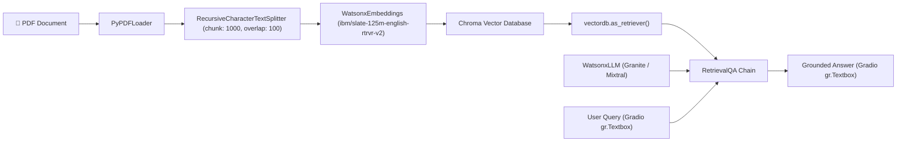

# Course 12: Project: Generative AI Applications with RAG and LangChain

## 📌 Project Overview
In this final capstone project for the Generative AI track of the **IBM AI Engineering Professional Certificate**, an end-to-end **Retrieval-Augmented Generation (RAG) assistant** was constructed using **LangChain**, **IBM Watsonx.ai foundational models**, **Chroma vector database**, and **Gradio**.

The assistant allows users to upload PDF documents and interact via natural language to get verifiable, grounded answers directly from the literature without hallucination.

---

## 🏗️ Architectural Pipeline

---

## 🎯 Final Assessment & Evaluation
- **Course Graded Quiz:** 100.00% (10/10) on first attempt.
- **Mark AI-Graded Final Assessment (Assignment 3551):** **15 / 15 (100.00%)** — *Legendary Performance!*
- **Official Certificate:** [HTTIZHHEA2C3](https://www.coursera.org/account/accomplishments/verify/HTTIZHHEA2C3) (Grade Achieved: 100%).
- **Archived Artifacts:**
  - Code: `qabot.py`
  - Gradio UI Template: `gradio_interface.html`
  - Submission Verification: `QA_bot.png`
