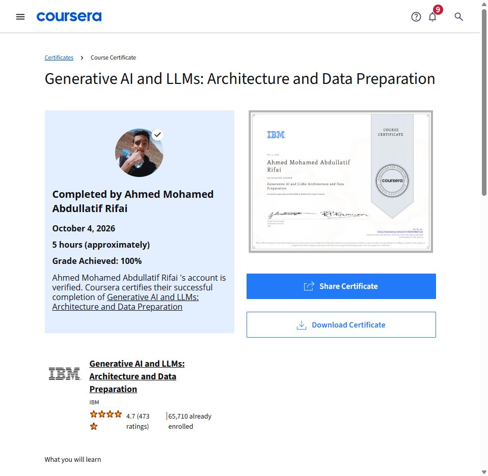

# Course 7: Generative AI and LLMs: Architecture and Data Preparation
**Provider:** IBM  
**Learner:** Eng. Ahmed Rifai  
**Status:** Completed (100.00% Grade)  
**Certificate Verification:** [Y651KNK8PT23](https://www.coursera.org/account/accomplishments/verify/Y651KNK8PT23)  
**Completion Date:** October 4, 2026  

---

## 📚 Course Overview
This course provides foundational mastery of Generative AI architectures, transformer backbones, attention mechanisms, and comprehensive data preparation pipelines for training Large Language Models (LLMs).

### Key Modules:
1. **Generative AI Architecture**
   - Autoregressive and sequence-to-sequence language models
   - Encoder-only, Decoder-only, and Encoder-Decoder architectures
   - Multi-Head Attention mechanisms and positional embeddings
   - Graded Quiz: **100% (5/5)**
2. **Data Preparation for LLMs**
   - Tokenization paradigms: Word-based, Character-based, and Subword-based (BPE, WordPiece)
   - Handling token continuations (`##` prefix in WordPiece)
   - Dataset cleaning, filtering noise, and deduplication
   - PyTorch `DataLoader`, batching, sequence standardization with padding (`<pad>`), and dataset shuffling
   - Graded Quiz: **100% (5/5)**

---

## 📜 Official Certificate

