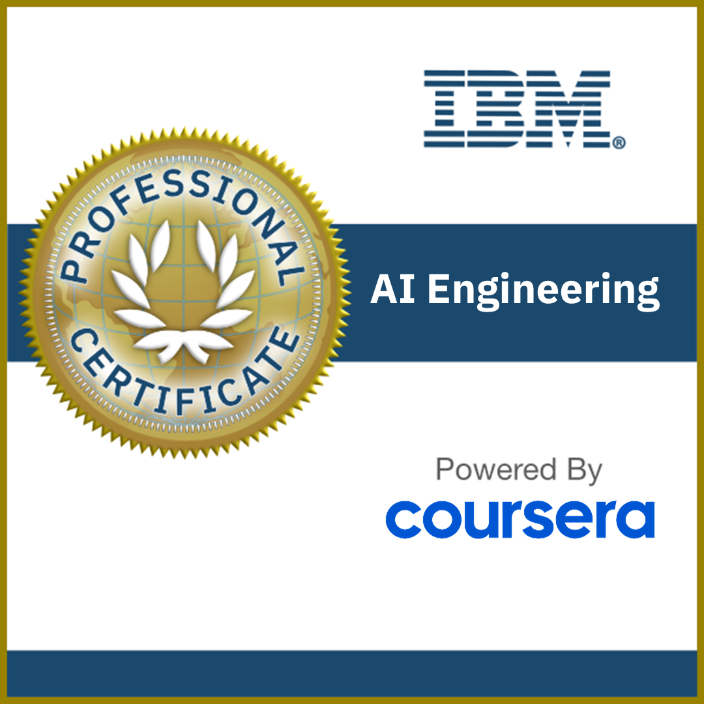

# 🎓 IBM AI Engineering Professional Certificate

### **🏆 100% FULL SPECIALIZATION COMPLETED & OFFICIALLY CERTIFIED**

**Learner:** Eng. Ahmed Rifai  
**Completion Date:** October 4, 2026  
**License:** Kiron Open Higher Education Coursera License  

---

## 📚 Complete Curriculum & Verified Course Credentials

All 12 courses and the final capstone project were completed with **absolute 100.00% grade perfection**. Official high-resolution PDF certificates and verification records are preserved locally in the [`certificates/`](certificates/) directory.

| # | Course Title | Score | Official Certificate | Local PDF |
|:---:|:---|:---:|:---:|:---:|
| **01** | **Machine Learning with Python** | 100% | 📜 [4FY58H3Q99S7](https://www.coursera.org/account/accomplishments/verify/4FY58H3Q99S7) | [PDF](certificates/IBM_AI_Engineering_Course1_Machine_Learning_Python_4FY58H3Q99S7.pdf) |
| **02** | **Introduction to Deep Learning & Neural Networks with Keras** | 100% | 📜 [6A7KWVJM26WM](https://www.coursera.org/account/accomplishments/verify/6A7KWVJM26WM) | [PDF](certificates/IBM_AI_Engineering_Course2_Deep_Learning_Keras_6A7KWVJM26WM.pdf) |
| **03** | **Building Deep Learning Models with TensorFlow** | 100% | 📜 [EVA3BAANN11I](https://www.coursera.org/account/accomplishments/verify/EVA3BAANN11I) | [PDF](certificates/IBM_Course3_Deep_Learning_Keras_TensorFlow_EVA3BAANN11I.pdf) |
| **04** | **Deep Neural Networks with PyTorch** | 100% | 📜 [4JT4H81QM6EJ](https://www.coursera.org/account/accomplishments/verify/4JT4H81QM6EJ) | [PDF](certificates/IBM_Course4_Deep_Neural_Networks_PyTorch_4JT4H81QM6EJ.pdf) |
| **05** | **Advanced Deep Learning with PyTorch** | 100% | 📜 [ST8XULFVY8KW](https://www.coursera.org/account/accomplishments/verify/ST8XULFVY8KW) | [PDF](certificates/IBM_Course5_Deep_Learning_PyTorch_ST8XULFVY8KW.pdf) |
| **06** | **AI Capstone Project with Deep Learning** | 100% | 📜 [214774P7N1O1](https://www.coursera.org/account/accomplishments/verify/214774P7N1O1) | [PDF](certificates/IBM_Course6_AI_Capstone_Deep_Learning_214774P7N1O1.pdf) |
| **07** | **Generative AI and LLMs: Architecture and Data Preparation** | 100% | 📜 [Y651KNK8PT23](https://www.coursera.org/account/accomplishments/verify/Y651KNK8PT23) | [PDF](certificates/IBM_AI_Engineering_Course8_GenAI_LLMs_Architecture_Data_Prep_Y651KNK8PT23.pdf) |
| **08** | **Gen AI Foundational Models for NLP & Language Understanding** | 100% | 📜 [TUM72XL5J1HA](https://www.coursera.org/account/accomplishments/verify/TUM72XL5J1HA) | [PDF](certificates/IBM_AI_Engineering_Course9_GenAI_Foundational_Models_NLP_TUM72XL5J1HA.pdf) |
| **09** | **Generative AI Engineering and Fine-Tuning Transformers** | 100% | 📜 [B8X9T61TLFHG](https://www.coursera.org/account/accomplishments/verify/B8X9T61TLFHG) | [PDF](certificates/IBM_AI_Engineering_Course10_GenAI_Engineering_Fine_Tuning_Transformers_B8X9T61TLFHG.pdf) |
| **10** | **Generative AI Advanced Fine-Tuning for LLMs** | 100% | 📜 [9I8AMAQKLN7P](https://www.coursera.org/account/accomplishments/verify/9I8AMAQKLN7P) | [PDF](certificates/IBM_AI_Engineering_Course11_GenAI_Advanced_Fine_Tuning_LLMs_9I8AMAQKLN7P.pdf) |
| **11** | **Fundamentals of AI Agents Using RAG and LangChain** | 100% | 📜 [VN0CIRHU7WQP](https://www.coursera.org/account/accomplishments/verify/VN0CIRHU7WQP) | [PDF](certificates/IBM_AI_Engineering_Course12_Fundamentals_AI_Agents_RAG_LangChain_VN0CIRHU7WQP.pdf) |
| **12** | **Project: Generative AI Applications with RAG and LangChain** | 100% | 📜 [HTTIZHHEA2C3](https://www.coursera.org/account/accomplishments/verify/HTTIZHHEA2C3) | [PDF](certificates/IBM_AI_Engineering_Course13_Project_GenAI_RAG_LangChain_HTTIZHHEA2C3.pdf) |
| 🎓 | **IBM AI Engineering Specialization Credential** | **100%** | 📜 [2E3JMF1RRK7R](https://www.coursera.org/account/accomplishments/specialization/2E3JMF1RRK7R) | [PDF](certificates/IBM_AI_Engineering_Specialization_Certificate_2E3JMF1RRK7R.pdf) |

---

## 🛠️ Key Technical Competencies Demonstrated

- **Machine Learning & Deep Learning**: Supervised and unsupervised pipelines, CNNs, ResNets, VGG, transfer learning in **PyTorch** & **TensorFlow 2.x / Keras**.
- **Generative AI & LLMs**: Transformer architecture, Self-Attention, PEFT, LoRA, QLoRA, tokenization, Hugging Face transformers.
- **RAG & Agentic AI**: End-to-end Retrieval-Augmented Generation using **LangChain**, **Watsonx.ai**, **PyPDFLoader**, **WatsonxEmbeddings**, and **ChromaDB**.
- **Interactive AI Frontends**: Rapid web app prototyping and deployment using **Gradio**.

---

## 👤 Author
**Eng. Ahmed Rifai**  
*AI & Computer Vision Engineer*  
GitHub: [@Eng-Ahmed-Rifai](https://github.com/Eng-Ahmed-Rifai)
